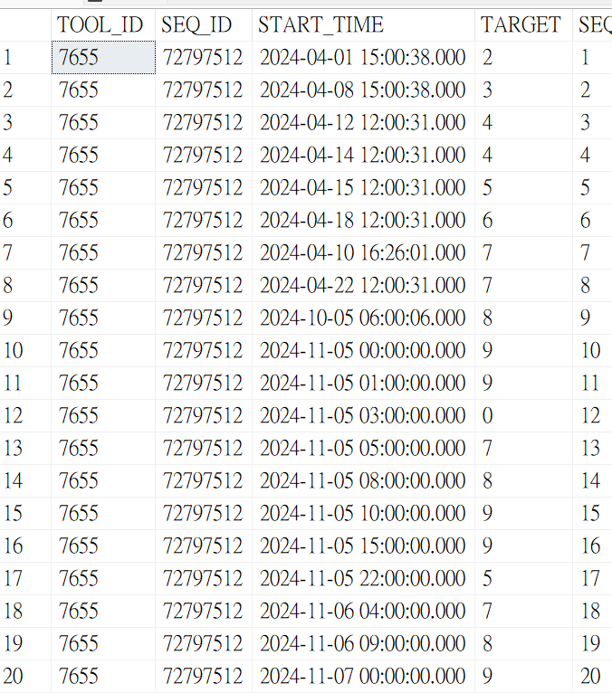
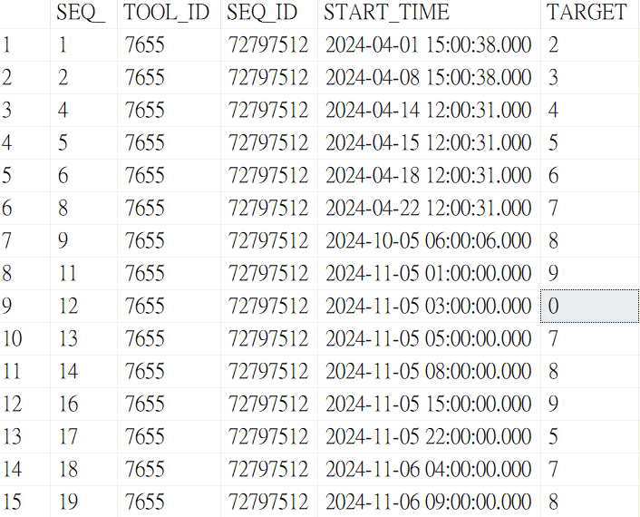
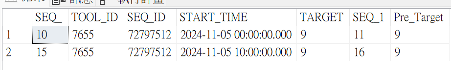

# 測試
## DB ([Teach].[dbo].[Announcement])

## ASP.NET畫面
(1) 前台介面，透過 Site/ChartID/起始+結束日期進行查詢，並顯示過濾結果。

(2) click me - 詳細資訊頁面。

(3) CheckBox - 預設多選

-----
----- Stage1
-----1. 先從retargetlist資料表搜尋出所有資料列(可能有重複的, 如果有連續retarget)
-----2. 同一筆chartID，就選start_Retarget_time最早的扣2小時，到現在的Start time

----- Stage2
------比對目前的chartID，是否都存在Max_Range_chart or Max_time是否<10
------將不存在的，先存入另外一張表，晚點再重算---------

-----Stage3
------底下是都存在的 & 大於Max_times
------先找出有進點的UVA HIST
set @Tool_id as narvarhr(50)
set @seq_id as narvarhr(50)
set @index as int
select count(*)  from retargetlist as index 
set @currentindex =1

while index >=0 @currentindex
	select @Tool_id = Tool_id, @seq_id =  seq_id, @start_time =startime from retargetlist
	where SEQ =  @currentindex 

	set SQL =' xxxTool_id, seq_id,seq_id,startime'

----Stage4
-------找出今天Start_Retarget_time之後有變動的資料，只取前面連續異動的筆數，若有被中斷則視為結束
-------將TARGET比對的結果寫入在Compare_MaxRange_Result()

set @Tool_id as narvarhr(50)
set @seq_id as narvarhr(50)
set @index as int
select count(*)  from retargetlist as index 
set @currentindex =1

while index >=0 @currentindex

	;WITH TARGET_CHG AS (
		SELECT 
			a.SEQ_, 
			a.TOOL_ID, 
			a.SEQ_ID, 
			a.START_TIME, 
			a.TARGET, 
			b.SEQ_ AS SEQ_1, 
			b.TARGET AS NEXT_Target,
			ABS(CAST(b.TARGET AS FLOAT) -CAST(a.TARGET AS FLOAT)) AS Delta_Range,
			ROW_NUMBER() OVER (ORDER BY a.SEQ_) AS RowNum
		FROM 
			[Teach].[dbo].[UVA_HIST] a
		INNER JOIN 
			[Teach].[dbo].[UVA_HIST] b
			ON a.SEQ_ = b.SEQ_ - 1 AND a.TARGET != b.TARGET  AND a.START_TIME > '2024-11-04 15:00:38.000' 
	)
	SELECT 
		TC.*, 
		CASE 
			WHEN TC.Delta_Range > MRC.MaxRange THEN 'Y' 
			ELSE 'N' 
		END AS RESULT
	FROM 
		TARGET_CHG TC
	LEFT JOIN 
		[Teach].[dbo].Max_Range_chart MRC
		ON TC.TOOL_ID = MRC.TOOL_ID AND TC.SEQ_ID = MRC.SEQ_ID
	WHERE 
		TC.SEQ_ - TC.RowNum = (SELECT MIN(SEQ_) - 1 FROM TARGET_CHG)
	ORDER BY 
		TC.SEQ_;

----Stage5
-----找出今天Start_Retarget_time之後有變平穩的Data，若有任一列SEQ > 上次異動的最後一筆SEQ_的值，則視為有END Retarget
-----從retargetlist中，過濾Start_Retarget_time資訊(最多只留下一筆還在進行中的資料，其他都移到HISTORY資料表)
;WITH TARGET_CHG_END AS (
    SELECT 
        a.SEQ_, 
        a.TOOL_ID, 
        a.SEQ_ID, 
        a.START_TIME, 
        a.TARGET, 
        b.SEQ_ AS SEQ_1, 
        b.TARGET AS Pre_Target
    FROM 
        [Teach].[dbo].[UVA_HIST] a
    INNER JOIN 
        [Teach].[dbo].[UVA_HIST] b
        ON a.SEQ_ = b.SEQ_ - 1 AND a.TARGET = b.TARGET  AND a.START_TIME > '2024-11-04 15:00:38.000' 
)
select *  from TARGET_CHG_END 

/*
insert into history()
select *,   result, JobStatus
from TARGET_CHG a  left join Max_Range_chart b
on a.MaxRange > b.Maxange ，result = alert，否則='pass'
---------------
-
-----------儲存chartID狀態的table(將STARET_SEQ最後一筆寫入)
Tool_ID, SEQ_ID, STARET_SEQ,END_RETARGET_TIME, END_SEQ
-----------儲存chartID狀態的table(將END_SEQ最後一筆寫入)
Tool_ID, SEQ_ID, STARET_SEQ, END_RETARGET_TIME, END_SEQ

---------比對結果，是否要從daily中移除----
--IF END_SEQ > STARET_SEQ ，則把retargetlisty 資料+ END_RETARGET_TIME時間後，搬到history
*/

