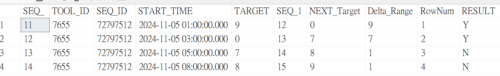

# 測試
## DB ([Teach].[dbo].[Announcement])

## ASP.NET畫面
(1) 前台介面，透過 Site/ChartID/起始+結束日期進行查詢，並顯示過濾結果。

(2) click me - 詳細資訊頁面。

(3) CheckBox - 預設多選

-----
select *
 FROM [Teach].[dbo].[TargetCompare];

SELECT 
    StartData.START_SEQ_,
    StartData.TOOL_ID,
    StartData.SEQ_ID,
    StartData.RETARGET_START,
    StartData.START_RETARGET_TARGET,
    EndData.END_RETARGET,
    EndData.END_RETARGET_TIME
FROM (
    -- 找出連續的第一筆資料
    SELECT 
        CAST(a.SEQ_ AS INT) AS START_SEQ_,
        a.TOOL_ID,
        a.SEQ_ID,
        a.START_TIME AS RETARGET_START,
        a.TARGET AS START_RETARGET_TARGET,
        ROW_NUMBER() OVER (ORDER BY CAST(a.SEQ_ AS INT)) AS RowNum
    FROM [Teach].[dbo].[TargetCompare] a
    LEFT JOIN [Teach].[dbo].[TargetCompare] b
        ON a.TOOL_ID = b.TOOL_ID 
        AND a.SEQ_ID = b.SEQ_ID
        AND a.SEQ_ = b.SEQ_ + 1
    WHERE b.SEQ_ IS NULL
) AS StartData
LEFT JOIN (
    -- 找出連續的最後一筆資料
    SELECT 
        CAST(a.SEQ_ AS INT) AS END_SEQ_,
        a.TOOL_ID,
        a.SEQ_ID,
        a.START_TIME AS END_RETARGET_TIME,
        a.TARGET AS END_RETARGET,
        ROW_NUMBER() OVER (ORDER BY CAST(a.SEQ_ AS INT)) AS RowNum
    FROM [Teach].[dbo].[TargetCompare] a
    LEFT JOIN [Teach].[dbo].[TargetCompare] b
        ON a.TOOL_ID = b.TOOL_ID 
        AND a.SEQ_ID = b.SEQ_ID
        AND a.SEQ_ = b.SEQ_ - 1
    WHERE b.SEQ_ IS NULL
) AS EndData
    ON StartData.RowNum = EndData.RowNum -- 使用 RowNum 對應合併
ORDER BY StartData.START_SEQ_;

----
